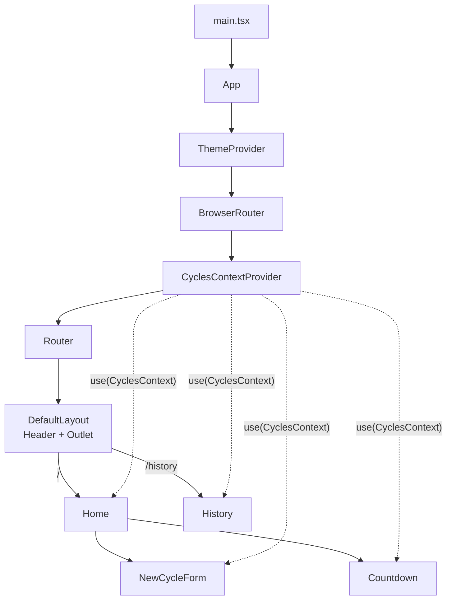

<h1 align="center">⏱️ Ignite Timer</h1>

<p align="center">
  A Pomodoro-style timer built during <strong>Rocketseat's Ignite</strong> program, with a countdown and a cycle history.
</p>

<p align="center">
  🇧🇷 <a href="./README.md">Português</a> · 🇺🇸 <strong>English</strong>
</p>

<p align="center">
  
  
  
  
</p>
<p align="center">
  
  
  
  
  
</p>

---

## 📑 Table of contents

- [About the project](#-about-the-project)
- [Features](#-features)
- [Tech stack](#-tech-stack)
- [Getting started](#-getting-started)
- [Folder structure](#-folder-structure)
- [Architecture and data flow](#-architecture-and-data-flow)
- [What I learned](#-what-i-learned)
  1. [Vite and TypeScript](#1-vite-and-typescript)
  2. [Application entry point](#2-application-entry-point)
  3. [Styling with styled-components](#3-styling-with-styled-components)
  4. [Typing the theme](#4-typing-the-theme)
  5. [Typed props in styled-components](#5-typed-props-in-styled-components)
  6. [Routing with React Router](#6-routing-with-react-router)
  7. [Forms with React Hook Form](#7-forms-with-react-hook-form)
  8. [State and immutability](#8-state-and-immutability)
  9. [Context API](#9-context-api)
  10. [useEffect and the countdown](#10-useeffect-and-the-countdown)
  11. [useCallback](#11-usecallback)
  12. [Dates with date-fns](#12-dates-with-date-fns)
  13. [Conditional rendering and lists](#13-conditional-rendering-and-lists)
  14. [Icons and assets](#14-icons-and-assets)
  15. [Accessibility](#15-accessibility)
  16. [Code quality: ESLint and Prettier](#16-code-quality-eslint-and-prettier)
  17. [Google Fonts](#17-google-fonts)
- [About me](#-about-me)

---

## 💡 About the project

**Ignite Timer** lets you enter the task you'll work on and for how many minutes. Once started, a countdown appears on screen and in the browser tab title. A cycle either finishes on its own when time runs out or can be interrupted manually, and every cycle is recorded on the history page along with its status.

> The interface text is in Portuguese (e.g. *Começar* = Start, *Interromper* = Interrupt, *Concluído* = Finished).

## ✨ Features

- [x] Create a cycle with a task name and a duration (5 to 60 minutes, in steps of 5)
- [x] Task name suggestions through `<datalist>`
- [x] `MM:SS` countdown, updated every second
- [x] Remaining time shown in the browser tab title
- [x] Interrupt the active cycle
- [x] Cycle automatically marked as finished when time runs out
- [x] History with task, duration, relative start time ("5 minutes ago") and status: **Finished**, **Interrupted** or **In progress**
- [x] Switch between Timer and History without losing the running cycle

## 🚀 Tech stack

| Category | Tool |
| --- | --- |
| UI library | [React 19](https://react.dev/) |
| Language | [TypeScript](https://www.typescriptlang.org/) |
| Build and dev server | [Vite](https://vite.dev/) |
| Styling | [styled-components](https://styled-components.com/) |
| Routing | [React Router](https://reactrouter.com/) |
| Forms | [React Hook Form](https://react-hook-form.com/) |
| Dates | [date-fns](https://date-fns.org/) |
| Icons | [Phosphor Icons](https://phosphoricons.com/) (`phosphor-react`) |
| Linting and formatting | [ESLint](https://eslint.org/) + [Prettier](https://prettier.io/) |

## 🛠️ Getting started

**Prerequisites:** [Node.js](https://nodejs.org/) (LTS version) and [Git](https://git-scm.com/).

```bash
# 1. Clone the repository
git clone https://github.com/ViniKnuivers/Curso-React-Rocketseat.git

# 2. Enter the folder
cd Curso-React-Rocketseat

# 3. Install dependencies
npm install --legacy-peer-deps

# 4. Start the dev server
npm run dev
```

Then open the address printed in the terminal (usually `http://localhost:5173`).

> [!NOTE]
> The `--legacy-peer-deps` flag is needed because `eslint-plugin-jsx-a11y` doesn't officially declare support for ESLint 10 yet. It makes npm ignore that peer dependency conflict, which only affects the linting tools, not the app itself.

### Available scripts

| Script | What it does |
| --- | --- |
| `npm run dev` | Starts the dev server with HMR (hot reload) |
| `npm run build` | Type-checks with `tsc -b` and builds the production version into `dist/` |
| `npm run preview` | Serves the `dist/` folder locally to test the build |
| `npm run lint` | Runs ESLint on the whole project |
| `npm run lint:fix` | Runs ESLint and auto-fixes whatever it can |
| `npm run format` | Formats every file with Prettier |

## 📂 Folder structure

```text
src/
├── @types/
│   └── styled.d.ts               # styled-components theme typing
├── assets/
│   └── Logo.svg
├── components/
│   ├── Header/                   # header with logo and navigation
│   │   ├── Index.tsx
│   │   └── styles.ts
│   └── global.ts                 # global styles (createGlobalStyle)
├── contexts/
│   ├── CyclesContext.ts          # types + createContext
│   └── CyclesContextProvider.tsx # cycle state and business rules
├── layouts/
│   └── DefaultLayouts/           # layout with Header + <Outlet />
├── pages/
│   ├── Home/
│   │   ├── components/
│   │   │   ├── Countdown/        # countdown timer
│   │   │   └── NewCycleForm/     # "task" and "minutes" fields
│   │   ├── Index.tsx
│   │   └── styles.ts
│   └── History/                  # history table
├── styles/
│   └── themes/
│       └── default.ts            # theme color palette
├── App.tsx                       # providers (theme, router, context)
├── main.tsx                      # entry point
└── router.tsx                    # route definitions
```

**Convention:** each component has its own folder, with the component and its styles (`styles.ts`) side by side. Components used by a single page live inside `pages/<Page>/components`.

## 🧭 Architecture and data flow



- `CyclesContextProvider` holds all cycle state (`cycles`, `activeCycleId` and `amountSecondsPassed`) and exposes the functions that change it.
- Because the provider wraps the `Router`, state survives page changes: you can open the history page and come back without losing the timer.
- Each component reads only what it needs from the context, without relying on props from parent components.

---

## 📚 What I learned

### 1. Vite and TypeScript

- The project was scaffolded with **Vite**, which provides a very fast dev server (built on the browser's native ES Modules) and **HMR**, updating the screen on save without losing state.
- `index.html` sits at the project root and is the real entry point: it loads `/src/main.tsx` through `<script type="module">`.
- The `@vitejs/plugin-react` plugin enables JSX and **Fast Refresh**.
- TypeScript uses **project references**: `tsconfig.json` just points to two files:
  - `tsconfig.app.json` → application code (`src`), with `lib: ["ES2023", "DOM"]` and `jsx: "react-jsx"`;
  - `tsconfig.node.json` → files that run on Node, such as `vite.config.ts`.
- `noEmit: true`: Vite produces the JavaScript; `tsc` only checks types. That's why the build script is `tsc -b && vite build`.
- Options such as `noUnusedLocals` and `noUnusedParameters` flag unused code.
- `verbatimModuleSyntax` requires type-only imports to be marked with `type`:

```ts
import { type ReactNode, useCallback, useState } from 'react';
```

### 2. Application entry point

```tsx
// src/main.tsx
createRoot(document.getElementById('root')!).render(
  <StrictMode>
    <App />
  </StrictMode>,
);
```

- `createRoot` (from `react-dom/client`) creates the React root inside `<div id="root">`.
- The `!` (*non-null assertion*) tells TypeScript the element exists, since `getElementById` can return `null`.
- `StrictMode` only acts in development: it runs some effects and renders twice to surface bugs, such as a `useEffect` missing its cleanup function.

`App.tsx` gathers the providers, nested inside each other:

```tsx
<ThemeProvider theme={defaultTheme}>
  <BrowserRouter>
    <CyclesContextProvider>
      <Router />
    </CyclesContextProvider>
  </BrowserRouter>
  <GlobalStyled />
</ThemeProvider>
```

### 3. Styling with styled-components

**CSS-in-JS**: CSS is written in template strings and becomes a React component with an auto-generated class name, so there are no naming collisions between components.

```ts
export const HeaderContainer = styled.header`
  display: flex;
  justify-content: space-between;

  nav {
    a {
      color: ${(props) => props.theme['gray-100']};

      &:hover {
        border-bottom: 3px solid ${(props) => props.theme['green-500']};
      }
    }
  }
`;
```

What was practiced:

- **Nested selectors** and `&` for pseudo-classes (`&:hover`, `&:focus`, `&:disabled`, `&:not(:disabled):hover`, `&:first-child`, `&:last-child`).
- **Pseudo-elements**, such as `&::before` to draw the colored status dot and `&::placeholder` for the input's placeholder text.
- **Theme access** through `props.theme`, thanks to `ThemeProvider`.
- **Style inheritance** with `styled(Component)`: a base component with the shared styles, and variants that only add what differs.

```ts
const BaseInput = styled.input`
  /* shared styles */
`;

export const TaskInput = styled(BaseInput)`
  flex: 1;
`;

export const MinutesAmountInput = styled(BaseInput)`
  width: 4rem;
`;
```

The same pattern shows up in the buttons: `BaseCountdownButton` → `StartCountdownButton` (green) and `StopCountdownButton` (red).

- **Global styles** with `createGlobalStyle`: `margin`/`padding` reset, `box-sizing`, background color, default font and a custom focus style.

```ts
export const GlobalStyled = createGlobalStyle`
  * { margin: 0; padding: 0; box-sizing: border-box; }

  :focus {
    outline: 0;
    box-shadow: 0 0 0 2px ${(props) => props.theme['green-500']};
  }
`;
```

- **Flexbox layout**: `flex: 1`, `flex-direction: column`, `gap`, `flex-wrap`, and centering with `align-items`/`justify-content`.
- `rem` units, `max-width` and `calc(100vh - 10rem)` to size the layout; `overflow: auto` with `min-width` so the history table scrolls on smaller screens.

### 4. Typing the theme

The theme is a plain object with the color palette:

```ts
// src/styles/themes/default.ts
export const defaultTheme = {
  'gray-100': '#E1E1E6',
  'green-500': '#00875F',
  'red-500': '#AB222E',
  // ...
};
```

To get autocomplete and type checking on `props.theme['green-500']`, a declaration file uses **declaration merging** to extend styled-components' `DefaultTheme` interface:

```ts
// src/@types/styled.d.ts
import 'styled-components';
import { defaultTheme } from '../styles/themes/default';

type ThemeType = typeof defaultTheme;

declare module 'styled-components' {
  export interface DefaultTheme extends ThemeType {}
}
```

- `typeof defaultTheme` derives the type from the value: adding a color to the object makes it show up in autocomplete right away.
- `declare module` reopens the library's module to add type information to it.
- A typo such as `props.theme['green-501']` is now reported by TypeScript.

### 5. Typed props in styled-components

A styled component can accept its own props, typed with generics:

```ts
const STATUS_COLORS = {
  yellow: 'yellow-500',
  green: 'green-500',
  red: 'red-500',
} as const;

interface StatusProps {
  statusColor: keyof typeof STATUS_COLORS;
}

export const Status = styled.span<StatusProps>`
  &::before {
    background: ${(props) => props.theme[STATUS_COLORS[props.statusColor]]};
  }
`;
```

```tsx
<Status statusColor="green">Concluído</Status>
```

- `as const` turns the values into literal types (`'green-500'` instead of `string`), so they can safely be used as theme keys.
- `keyof typeof STATUS_COLORS` produces the union `'yellow' | 'green' | 'red'`: only those three colors are accepted.
- The map separates the semantic name used in the component from the actual theme key.

### 6. Routing with React Router

```tsx
// src/router.tsx
<Routes>
  <Route path="/" element={<DefaultLayout />}>
    <Route path="/" element={<Home />} />
    <Route path="/history" element={<History />} />
  </Route>
</Routes>
```

- `BrowserRouter` uses the browser's History API to have real URLs (`/history`) without reloading the page, making it a **SPA**.
- `Routes` and `Route` map paths to components.
- **Nested routes + layout**: the parent route renders `DefaultLayout`, and child routes are rendered in place of `<Outlet />`. This way the `Header` is written once and shared by every page.

```tsx
export function DefaultLayout() {
  return (
    <LayoutContainer>
      <Header />
      <Outlet />
    </LayoutContainer>
  );
}
```

- `NavLink` navigates without reloading the page and knows when its route is active (adding the `active` class).

```tsx
<NavLink to="/" title="timer">
  <Timer size={24} />
</NavLink>
```

### 7. Forms with React Hook Form

**Controlled vs. uncontrolled:** in a controlled form, every keystroke updates state and re-renders the component. React Hook Form works in an **uncontrolled** way, reading values straight from the inputs via `ref`, which makes the form faster and the code leaner.

```tsx
interface NewCycleFormData {
  task: string;
  minutesAmount: number;
}

const newCycleForm = useForm<NewCycleFormData>();
const { handleSubmit, watch, reset } = newCycleForm;
```

- `useForm<T>()` creates the form already typed with the shape of the data.
- `register('field')` connects an input to the form, returning `name`, `ref`, `onChange` and `onBlur` (hence the spread `{...register('task')}`).
- `valueAsNumber: true` converts the input value to a `number`:

```tsx
<MinutesAmountInput
  type="number"
  step={5}
  min={5}
  max={60}
  {...register('minutesAmount', { valueAsNumber: true })}
/>
```

- `handleSubmit(fn)` prevents the default page reload on submit and calls `fn` with the collected data.
- `watch('task')` observes the field in real time and disables the button while the task is empty:

```tsx
const task = watch('task');
const isSubmitDisabled = !task;
```

- `reset()` clears the form after the cycle is created.
- **`FormProvider` + `useFormContext`**: the form is created in `Home`, but the inputs live in `NewCycleForm`. Instead of passing `register` down as a prop, `Home` wraps the child in `FormProvider`, and the child retrieves the methods with `useFormContext()`:

```tsx
// Home
<FormProvider {...newCycleForm}>
  <NewCycleForm />
</FormProvider>

// NewCycleForm
const { register } = useFormContext();
```

- **`void` on Promises:** `handleSubmit` returns a Promise that `onSubmit` doesn't await; the type-aware lint rules require making that explicit:

```tsx
<form onSubmit={(event) => void handleSubmit(handleCreateNewCycle)(event)}>
```

### 8. State and immutability

```tsx
const [cycles, setCycles] = useState<Cycle[]>([]);
const [activeCycleId, setActiveCycleId] = useState<string | null>(null);
const [amountSecondsPassed, setAmountSecondsPassed] = useState(0);
```

- `useState<T>` with generics to type state that starts empty (`[]` or `null`).
- **Immutability:** React only detects changes when it receives a new object or array. So no `push` or direct mutation: we create copies with spread and `map`.

```tsx
// add
setCycles((state) => [...state, newCycle]);

// update one item
setCycles((state) =>
  state.map((cycle) =>
    cycle.id === activeCycleId ? { ...cycle, interruptedDate: new Date() } : cycle,
  ),
);
```

- **Functional updates** (`(state) => ...`): when the new value depends on the previous one, the function guarantees we're using the latest state.
- **Derived state:** the active cycle isn't a separate piece of state; it's computed from the other two, avoiding duplicated, out-of-sync data.

```tsx
const activeCycle = cycles.find((cycle) => cycle.id === activeCycleId);
```

- **Modeling with interfaces and optional fields (`?`)**: a cycle's status is inferred from which dates are present.

```ts
export interface Cycle {
  id: string;
  task: string;
  minutesAmount: number;
  startDate: Date;
  interruptedDate?: Date;
  finishedDate?: Date;
}
```

- A simple unique id is generated from the timestamp: `String(new Date().getTime())`.

### 9. Context API

**Problem:** `Home`, `NewCycleForm`, `Countdown` and `History` all need the same information. Passing everything down through props (*prop drilling*) is tedious and couples components together.

**Solution:** a context that makes the state available to any component below the provider.

1. Create the typed context (`CyclesContext.ts`):

```ts
interface CyclesContextType {
  cycles: Cycle[];
  activeCycle: Cycle | undefined;
  activeCycleId: string | null;
  amountSecondsPassed: number;
  markCurrentCycleAsFinished: () => void;
  setSecondsPassed: (seconds: number) => void;
  createNewCycle: (data: CreateCycleData) => void;
  interruptCurrentCycle: () => void;
}

export const CyclesContext = createContext({} as CyclesContextType);
```

2. Create the provider component (`CyclesContextProvider.tsx`), which holds the state and business rules and receives `children: ReactNode`. In **React 19**, the context itself can be rendered as the provider (previously `<CyclesContext.Provider>`):

```tsx
return (
  <CyclesContext value={{ cycles, activeCycle, createNewCycle /* ... */ }}>
    {children}
  </CyclesContext>
);
```

3. Consume the context with React 19's new **`use()`** hook (instead of `useContext`):

```tsx
const { activeCycle, createNewCycle, interruptCurrentCycle } = use(CyclesContext);
```

**Good practices learned:**

- Split the context and the provider into two files: the `react-refresh/only-export-components` rule requires `.tsx` files to export only components, so Fast Refresh works.
- Expose **functions**, not raw setters: components call `createNewCycle` or `interruptCurrentCycle`, and the logic stays centralized in the provider.
- Place the provider above the `Router` to keep state across pages.

### 10. useEffect and the countdown

`Countdown` uses `useEffect` to synchronize the component with something outside React: a timer interval.

```tsx
useEffect(() => {
  let interval: number;
  if (activeCycle) {
    interval = setInterval(() => {
      const secondsDifference = differenceInSeconds(new Date(), activeCycle.startDate);

      if (secondsDifference >= totalSeconds) {
        markCurrentCycleAsFinished();
        setSecondsPassed(totalSeconds);
        clearInterval(interval);
      } else {
        setSecondsPassed(secondsDifference);
      }
    }, 1000);
  }

  return () => clearInterval(interval);
}, [activeCycle, totalSeconds, markCurrentCycleAsFinished, setSecondsPassed]);
```

- **Dependency array:** the effect runs again whenever one of these values changes.
- **Cleanup function:** `return () => clearInterval(interval)` runs before the next effect and when the component unmounts. Without it, old intervals would keep running in parallel.
- **Time accuracy:** instead of adding `+1` on each tick (`setInterval` isn't exact and gets throttled in inactive tabs), elapsed time is computed from the difference between now and the start date, so the countdown doesn't drift.

Computing what is displayed:

```tsx
const totalSeconds = activeCycle ? activeCycle.minutesAmount * 60 : 0;
const currentSeconds = activeCycle ? totalSeconds - amountSecondsPassed : 0;

const minutesAmount = Math.floor(currentSeconds / 60);
const secondsAmount = currentSeconds % 60;

const minutes = String(minutesAmount).padStart(2, '0'); // 5 -> "05"
const seconds = String(secondsAmount).padStart(2, '0');
```

- `Math.floor` and the remainder operator `%` split minutes and seconds.
- `padStart(2, '0')` always guarantees two digits.
- Strings can be accessed by index (`minutes[0]`, `minutes[1]`), which allows each digit to be rendered in its own box.

A second `useEffect` syncs the browser tab title with the countdown:

```tsx
useEffect(() => {
  if (activeCycle) {
    document.title = `${minutes}:${seconds}`;
  }
}, [minutes, seconds, activeCycle]);
```

### 11. useCallback

Functions declared inside a component are recreated on every render. Since `markCurrentCycleAsFinished` is a dependency of `Countdown`'s `useEffect`, a new reference on every render would cause the interval to be recreated constantly.

```tsx
const markCurrentCycleAsFinished = useCallback(() => {
  setCycles((state) =>
    state.map((cycle) =>
      cycle.id === activeCycleId ? { ...cycle, finishedDate: new Date() } : cycle,
    ),
  );
  setActiveCycleId(null);
}, [activeCycleId]);
```

- `useCallback` memoizes the function and only creates a new one when `activeCycleId` changes.
- `setAmountSecondsPassed` (exposed as `setSecondsPassed`), on the other hand, comes from `useState` and is stable by nature, so it can go straight into the context.

### 12. Dates with date-fns

- `differenceInSeconds(dateA, dateB)`: exact difference in seconds, used by the countdown.
- `formatDistanceToNow(date, { addSuffix: true, locale: ptBR })`: relative text such as "há cerca de 1 hora" ("about 1 hour ago"), used on the history page.
- Portuguese localization by importing `ptBR` from `date-fns/locale`.
- The library is modular: we import only the functions we use, keeping the bundle smaller.

### 13. Conditional rendering and lists

A ternary toggles between the **Start** (*Começar*) and **Interrupt** (*Interromper*) buttons:

```tsx
{activeCycle ? (
  <StopCountdownButton onClick={interruptCurrentCycle} type="button">
    <HandPalm size={24} />
    Interromper
  </StopCountdownButton>
) : (
  <StartCountdownButton disabled={isSubmitDisabled} type="submit">
    <Play size={24} />
    Começar
  </StartCountdownButton>
)}
```

- The interrupt button is `type="button"` so it doesn't submit the form.
- `&&` renders something only when a condition is true (each cycle's status).
- Lists with `map` and a unique `key` prop so React can identify each table row:

```tsx
{cycles.map((cycle) => (
  <tr key={cycle.id}>...</tr>
))}
```

- Inputs are disabled while a cycle is active with `disabled={!!activeCycle}` (`!!` converts the value to a boolean).

### 14. Icons and assets

**Phosphor** icons are React components configurable through props:

```tsx
import { HandPalm, Play, Scroll, Timer } from 'phosphor-react';

<Timer size={24} />
```

It also covered importing an SVG as a file, in which case Vite returns the asset URL:

```tsx
import Logo from '../../assets/Logo.svg';


```

### 15. Accessibility

- `<label htmlFor="task">` linked to the input's `id`: clicking the text focuses the field, and screen readers announce the label.
- `alt=""` on decorative images so screen readers skip them.
- `title` on icon-only links.
- `<datalist>` for native autocomplete suggestions, no library needed.
- Semantic elements: `header`, `nav`, `main`, `table`, `thead` and `tbody`.
- A visible `:focus` style for keyboard users.
- The `eslint-plugin-jsx-a11y` plugin flags accessibility issues right in the editor.

### 16. Code quality: ESLint and Prettier

The project uses ESLint's **flat config** format (`eslint.config.js`) with:

| Plugin / config | Role |
| --- | --- |
| `@eslint/js` | Recommended JavaScript rules |
| `typescript-eslint` (`recommendedTypeChecked`) | Rules that use TypeScript's type information (`projectService: true`), such as detecting unhandled Promises |
| `@eslint-react/eslint-plugin` | React-specific best practices |
| `eslint-plugin-jsx-a11y` | Accessibility |
| `eslint-plugin-react-refresh` | Compatibility with Vite's Fast Refresh |
| `eslint-plugin-simple-import-sort` | Automatic sorting of imports and exports |
| `eslint-plugin-prettier/recommended` | Runs Prettier as an ESLint rule and turns off conflicting style rules (always last) |

- **Per-file-type configuration:** browser globals for application code, Node globals for config files, and non-type-aware rules for `.js` files.
- **Custom rules:** allow unused variables starting with `_`, and allow `interface X extends Y {}` (used in the theme typing).

### 17. Google Fonts

In `index.html`, the **Roboto** and **Roboto Mono** fonts are loaded from Google Fonts. The `<link rel="preconnect">` tags open the connection to the font servers early, speeding up loading, and the `display=swap` parameter shows a fallback font while the final one loads.

---

## 👨‍💻 About me

I'm **Vinicius Knuivers**, a Computer Science student at Faculdade Municipal Prof. Franco Montoro (Mogi Guaçu, Brazil). I'm growing as a fullstack developer through Rocketseat's Ignite program, studying React on the frontend and Node.js on the backend, always with TypeScript.

<p>
  <a href="https://github.com/ViniKnuivers">
    
  </a>
  <a href="mailto:vini.knui@gmail.com">
    
  </a>
</p>

---

<p align="center">Made with 💚 during Rocketseat's Ignite</p>
